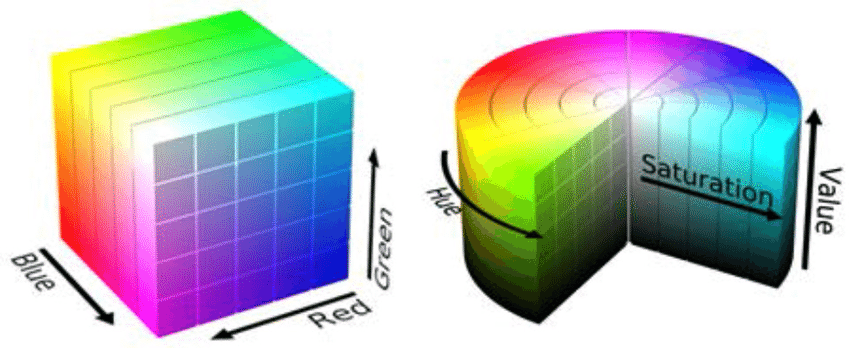
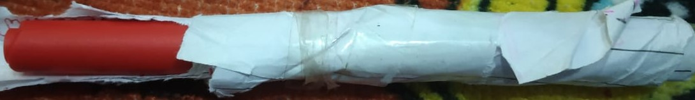
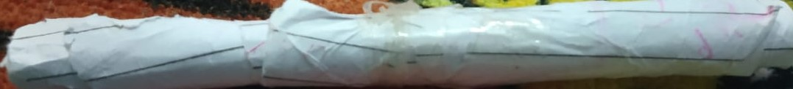

# Virtual-Pen-OpenCV

# Please Note this project was completed only using OpenCv

This Project was completed using OpenCv only, If you hope to find Deep Learning and Machine Learning in this project then you won't find any!!!

This Project was done using 6 steps:

1) Find the color range of the target object and save it

2) Apply the correct morphological operation to reduce noise in the video

3) Detect and track the colored object with contour detection.

4) Find the object's x,y location coordinates to draw on the screen

5) Add a Wiper Functionality to wipe off the Whole screen

6) Add an Eraser Functionality to erase parts of the drawing

Before moving on I strongly recommend you to check Edge detection, Countor Detection, BacgroundSubtractor and look how to find them in OpenCV and all the Parameteres they accept

And do check about RBG, HSV

And yeah please select pen somthing like this:

So that when ever you want write next alphabet you just have to switch the position pen and program no longer detect the pen and you can write next alphabet where-ever you want in the screen

Please find the code for virtual pen in virtualPen.ipynb

Feel free to set your own range during mask, and to set the upper and lower range for cv2.inRange() you can run  file.

Ok lets get Started!!!

